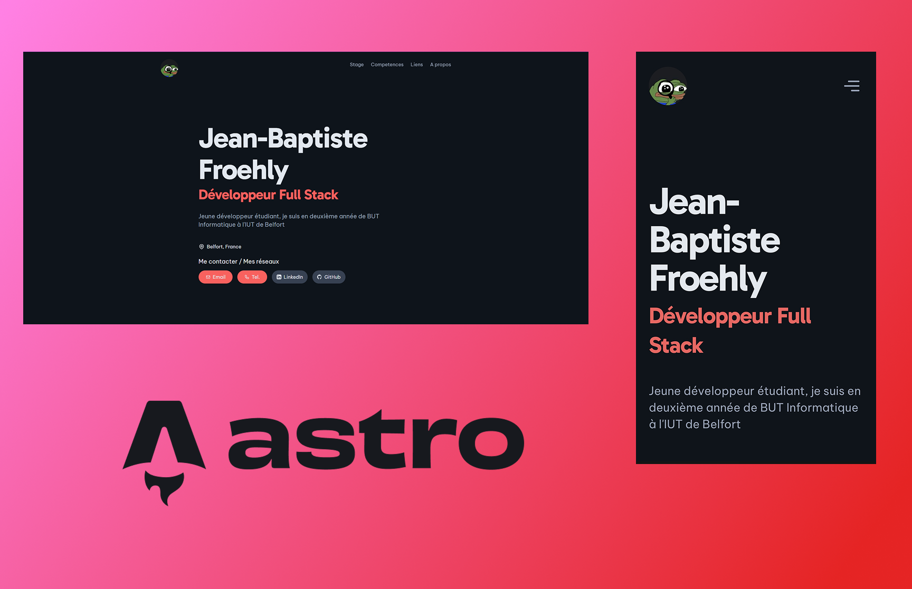

# Portfolio S4 de moi même host sous Vercel



## \>> [Lien](https://portfolio-s4-gamma.vercel.app/) <<

## Cloner le projet

```bash
git clone https://github.com/sirthirrygolooo/portfolio-s4
```

## Installation - PNPM - [Installation pnpm](https://pnpm.io/installation)

```bash
pnpm install
```

## Lancement

```bash
npm run start
```

ou 

```bash
pnpm start
```